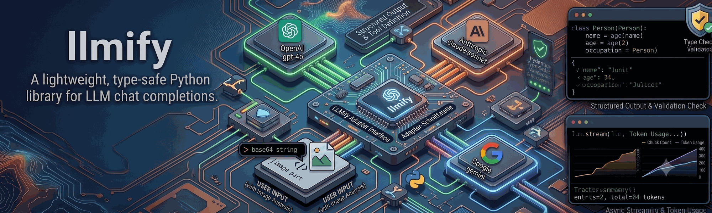

# llmify



A lightweight, type-safe Python library for LLM chat completions.

**Features:**

- Simple, intuitive API for OpenAI, Azure OpenAI, Cerebras, Anthropic, and Google Gemini
- Type-safe structured outputs with Pydantic
- Built-in tool calling support
- Async streaming
- Image analysis support
- Optional token usage and cost tracking
- Minimal dependencies, maximum flexibility

## Installation

```bash
pip install py-llmify
```

Install only the provider you need:

```bash
pip install py-llmify[openai]      # OpenAI + Azure OpenAI
pip install py-llmify[cerebras]    # Cerebras
pip install py-llmify[anthropic]   # Anthropic (Claude)
pip install py-llmify[google]      # Google Gemini
pip install py-llmify[all]         # All providers
pip install py-llmify[tokens]      # Token tracking + Tokenary cost calculation
```

The `tokens` extra currently requires Python 3.13 because that is the minimum
Python version supported by Tokenary. Extras can be combined, for example:

```bash
pip install py-llmify[openai,tokens]
```

## Quick Start

```python
import asyncio
from llmify import ChatOpenAI, UserMessage, SystemMessage

async def main():
    llm = ChatOpenAI(model="gpt-4o")

    response = await llm.invoke([
        SystemMessage(content="You are a helpful assistant"),
        UserMessage(content="What is 2+2?")
    ])

    print(response.completion)  # "2+2 equals 4"

asyncio.run(main())
```

All `invoke` calls return a `ChatInvokeCompletion[T]` with:

- `completion` — the text (or parsed Pydantic model) returned by the model
- `tool_calls` — list of `ToolCall` objects, if any
- `usage` — token usage (`ChatInvokeUsage`)
- `stop_reason` — why the model stopped

## Core Features

### Message Types

```python
from llmify import SystemMessage, UserMessage, AssistantMessage, ToolResultMessage

messages = [
    SystemMessage(content="You are a Python expert"),
    UserMessage(content="How do I read a file?"),
    AssistantMessage(content="You can use open() with a context manager"),
    UserMessage(content="Show me an example"),
]
```

#### Image messages

Pass images inline inside a `UserMessage` using content parts:

```python
from llmify import UserMessage, ContentPartTextParam, ContentPartImageParam, ImageURL

message = UserMessage(
    content=[
        ContentPartTextParam(text="What's in this image?"),
        ContentPartImageParam(
            image_url=ImageURL(
                url="data:image/jpeg;base64,<base64data>",
                media_type="image/jpeg",
                detail="high",
            )
        ),
    ]
)
```

### Structured Outputs

Pass `output_format` to get a validated Pydantic model back:

```python
from pydantic import BaseModel
from llmify import ChatOpenAI, UserMessage

class Person(BaseModel):
    name: str
    age: int
    occupation: str

async def main():
    llm = ChatOpenAI(model="gpt-4o")

    response = await llm.invoke(
        [UserMessage(content="Extract: John is 32 and works as a data scientist")],
        output_format=Person,
    )

    person = response.completion  # type: Person
    print(f"{person.name}, {person.age}, {person.occupation}")
    # John, 32, data scientist

asyncio.run(main())
```

### Tool Calling

#### `@tool` decorator

Define tools from plain Python functions:

```python
import json
from llmify import ChatOpenAI, UserMessage, AssistantMessage, ToolResultMessage, tool

@tool
def get_weather(location: str, unit: str = "celsius") -> str:
    """Get current weather for a location"""
    return f"Weather in {location}: 22°{unit[0].upper()}, Sunny"

async def main():
    llm = ChatOpenAI(model="gpt-4o")
    messages = [UserMessage(content="What's the weather in Paris?")]

    response = await llm.invoke(messages, tools=[get_weather])

    if response.tool_calls:
        tc = response.tool_calls[0]
        args = json.loads(tc.function.arguments)
        result = get_weather(**args)

        messages.append(AssistantMessage(content=response.completion, tool_calls=response.tool_calls))
        messages.append(ToolResultMessage(tool_call_id=tc.id, content=result))

        final = await llm.invoke(messages)
        print(final.completion)

asyncio.run(main())
```

#### `RawSchemaTool`

Use a raw JSON schema when you need full control over the tool definition:

```python
import json
from llmify import ChatOpenAI, UserMessage, AssistantMessage, ToolResultMessage, RawSchemaTool

search_tool = RawSchemaTool(
    name="search_web",
    description="Search the web for information",
    schema={
        "type": "object",
        "properties": {
            "query": {"type": "string", "description": "Search query"},
            "max_results": {"type": "integer", "default": 5},
        },
        "required": ["query"],
    },
)

async def main():
    llm = ChatOpenAI(model="gpt-4o-mini")
    messages = [UserMessage(content="Search for Python 3.13 features")]

    response = await llm.invoke(messages, tools=[search_tool])

    if response.tool_calls:
        tc = response.tool_calls[0]
        args = json.loads(tc.function.arguments)
        result = my_search_fn(**args)

        messages.append(AssistantMessage(content=response.completion, tool_calls=response.tool_calls))
        messages.append(ToolResultMessage(tool_call_id=tc.id, content=result))

        final = await llm.invoke(messages)
        print(final.completion)

asyncio.run(main())
```

#### Dict schema

Pass raw OpenAI-style tool dicts directly:

```python
tools = [
    {
        "type": "function",
        "function": {
            "name": "get_weather",
            "description": "Get the current weather",
            "parameters": {
                "type": "object",
                "properties": {
                    "city": {"type": "string"},
                },
                "required": ["city"],
            },
        },
    }
]

response = await llm.invoke(messages, tools=tools)
print(response.tool_calls[0].function.name)
print(json.loads(response.tool_calls[0].function.arguments))
```

### Streaming

```python
import json
from llmify import ChatOpenAI, UserMessage, StreamEventType

async def main():
    llm = ChatOpenAI()
    chunk_count = 0

    async for event in llm.stream([UserMessage(content="Write a haiku about Python")]):
        if event.type is StreamEventType.TEXT:
            chunk_count += 1
            print(f"[{chunk_count:02d}]{event.delta}", end="", flush=True)
        elif event.type is StreamEventType.END:
            print(f"\n[stream_end stop={event.stop_reason}]")

asyncio.run(main())
```

For streaming with tools, handle `StreamEventType.TOOL_CALL` and parse the complete JSON arguments:

```python
import json
from llmify import ChatOpenAI, UserMessage, StreamEventType

async def main():
    llm = ChatOpenAI()

    async for event in llm.stream(messages, tools=[get_weather]):
        if event.type is StreamEventType.TEXT:
            print(event.delta, end="", flush=True)
        elif event.type is StreamEventType.TOOL_CALL:
            args = json.loads(event.tool_call.function.arguments)
            result = get_weather(**args)
            print(f"\n[tool_result] {result}")
        elif event.type is StreamEventType.END:
            print(f"\n[stream_end stop={event.stop_reason} tokens={event.usage.total_tokens if event.usage else 'unknown'}]")

asyncio.run(main())
```

Full runnable example: `examples/streaming_tool_calls.py`

### Token Usage Tracking

Every provider exposes the model it talks to via the required `.model` property:

```python
llm = ChatOpenAI(model="gpt-4o")
print(llm.model)  # "gpt-4o"
```

Token tracking is an optional feature. Install `py-llmify[tokens]`, then create a
`TokenTracker` and feed it the usage you care about. Its `add` method accepts a
`ChatInvokeUsage`, a full `ChatInvokeCompletion`, or a `StreamEnd` event, together
with the model name (conveniently available as `llm.model`). The same tracker can
aggregate usage and Tokenary-backed USD costs across many calls and models:

```python
from llmify import ChatOpenAI, ChatAnthropic, UserMessage
from llmify.tokens import ModelName, TokenTracker, calculate_cost, calculate_costs

tracker = TokenTracker()
gpt_model = ModelName.GPT_4O
claude_model = ModelName.CLAUDE_SONNET_4_20250514
gpt = ChatOpenAI(model=gpt_model)
claude = ChatAnthropic(model=claude_model)

# Pass the completion object directly...
r1 = await gpt.invoke([UserMessage(content="Hi")])
tracker.add(r1, model=gpt_model)

r2 = await gpt.invoke([UserMessage(content="How are you?")])
tracker.add(r2, model=gpt_model)

# ...or a StreamEnd event (or a raw ChatInvokeUsage).
async for event in claude.stream([UserMessage(content="Hi")]):
    if event.type == "end":
        tracker.add(event, model=claude_model)

summary = tracker.summary()     # UsageSummary across both providers
print(summary.entry_count)              # 3
print(summary.total_tokens)             # e.g. 84
print(summary.total_prompt_tokens)
print(summary.total_completion_tokens)
print(summary.total_prompt_cached_tokens)

cost = calculate_cost(r1, model=gpt_model)  # Tokenary CostBreakdown
print(cost.total_cost)

# Aggregate an existing same-model chain without building a tracker.
chain_cost = calculate_costs([r1, r2], model=gpt_model)
print(chain_cost.total_cost)

# A tracker also supports multi-model chains because every entry is tagged.
cost_summary = tracker.cost_summary()
print(cost_summary.currency)                # "USD"
print(cost_summary.total_cost)
print(tracker.costs())                      # per-call Tokenary CostBreakdown list

print(tracker.entries)          # per-call TokenUsageEntry list (each tagged with `model`)
tracker.reset()                 # start a fresh accounting window
```

Cost calculation uses Tokenary's bundled model catalog. An unknown model raises
`KeyError`; missing usage raises `ValueError`.

Full runnable example: `examples/token_tracking.py`

## Configuration

### Environment Variables

```bash
# OpenAI
export OPENAI_API_KEY="sk-..."

# Azure OpenAI
export AZURE_OPENAI_API_KEY="..."
export AZURE_OPENAI_ENDPOINT="https://<resource>.openai.azure.com/"

# Cerebras
export CEREBRAS_API_KEY="csk-..."

# Anthropic
export ANTHROPIC_API_KEY="sk-ant-..."

# Google Gemini
export GEMINI_API_KEY="..."
```

### Model Parameters

Set defaults when initializing or override per request:

```python
llm = ChatOpenAI(
    model="gpt-4o",
    temperature=0.7,
    max_tokens=1000,
)

response = await llm.invoke(
    messages=[UserMessage(content="Hi")],
    temperature=0.2,
    max_tokens=500,
)
```

Supported parameters: `temperature`, `max_tokens`, `top_p`, `frequency_penalty`, `presence_penalty`, `stop`, `seed`.

## Providers

### OpenAI

```python
from llmify import ChatOpenAI

llm = ChatOpenAI(
    model="gpt-4o",
    api_key="sk-...",  # optional if OPENAI_API_KEY is set
)
```

### Azure OpenAI

```python
from llmify import ChatAzureOpenAI

llm = ChatAzureOpenAI(
    model="gpt-4o",
    api_key="...",           # optional if AZURE_OPENAI_API_KEY is set
    azure_endpoint="https://<resource>.openai.azure.com/",  # optional if env var is set
)
```

### Anthropic

```python
from llmify import ChatAnthropic

llm = ChatAnthropic(
    model="claude-sonnet-4-20250514",
    api_key="sk-ant-...",  # optional if ANTHROPIC_API_KEY is set
)
```

The Anthropic provider supports the same API surface — `invoke`, `stream`, structured output, and tool calling — all mapped to the Anthropic messages API under the hood.

### Cerebras

```python
from llmify import ChatCerebras

llm = ChatCerebras(
    model="gpt-oss-120b",
    api_key="csk-...",  # optional if CEREBRAS_API_KEY is set
)
```

The Cerebras provider uses Cerebras' OpenAI-compatible API and supports `invoke`, `stream`, structured output, and tool calling.

### Google Gemini

```python
from llmify import ChatGoogle

llm = ChatGoogle(
    model="gemini-3.5-flash",
    api_key="...",  # optional if GEMINI_API_KEY is set
)
```

The Google provider supports the same API surface: `invoke`, `stream`, structured output, and tool calling.

## Credits

Inspired by [LangChain](https://github.com/langchain-ai/langchain) and [browser-use](https://github.com/browser-use/browser-use).

## License

MIT
